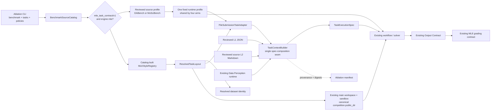

# Cross-Benchmark Data Card Ablation Architecture

**Status:** Accepted

## Decision

Data Card ablation is a capability-driven experiment over the existing MLE
benchmark runtime. A benchmark is discovered through `BenchmarkSourceCatalog`
and is eligible when its source descriptor declares both:

```text
contract_id = mle_task_contract/v1
engine_id   = mle
```

The runner does not infer benchmark behavior from task-ID prefixes and does not
reimplement registry, task layout, submission, or grading logic. The catalog
and the selected source's normal MLE-style registry remain authoritative for
task descriptions, public data, sample submissions, evaluation references,
and grading contracts.

DABench and MoSciBench have reviewed experiment profiles. A profile contains
only source-level experiment settings: the default workflow, the reviewed L2
artifact, and fixed runtime configuration overrides. It does not replace the
MLE task contract or introduce benchmark conditionals into core task-context
code. Another compatible source can participate after a reviewed profile and
artifacts are registered.

The ablation layer consumes only three capabilities from the shared MLE
contract: registry construction, canonical task-layout resolution, and
semantic dataset identity. It does not define another public-data path,
workspace, or execution environment. Every supported benchmark continues to
use the resolved `competition.public_dir` and the normal main workspace and
sandbox path.

The four policies are `main`, `l1`, `l2`, and `l3`. There is no L0 policy. The
benchmark's original dataset-description section already supplies the basic
dataset inventory, so a separate L0 arm would duplicate the baseline rather
than isolate a new treatment.

## Experimental variable

Only two solver-visible context slots may vary:

| Policy | Dataset-description slot | L2 guidance |
| --- | --- | --- |
| `main` | Original benchmark text | None |
| `l1` | Replace the original body with one reviewed L1 semantic map | None |
| `l2` | Original benchmark text | Append the source profile's reviewed guidance |
| `l3` | Same replacement as `l1` | Same guidance as `l2` |

L3 is the deterministic composition of L1 and L2, not an independently
generated context. The following owners and outputs are fixed across all four
arms of one benchmark invocation:

- Data Perception execution and its complete report;
- the Data Profile contained in that report;
- solver I/O instructions and output artifact name;
- the submission artifact contract;
- workflow-level Output Contract configuration and behavior;
- the source registry, evaluation contract, and grading path.

Profiles may select different reviewed baseline settings for different
benchmarks. For example, DABench and MoSciBench can use different workflows or
Output Contract settings. Those settings are established before arm creation
and are identical across every arm in that invocation; task-context policies
cannot change them.

## Boundary and control flow



The experiment selects exactly one source per invocation. Catalog capability
checking establishes the common runtime shape; the profile supplies the small
amount of reviewed source-specific policy. Task selection is resolved through
the catalog-built registry before any arm starts.

## Canonical-layout experiment opt-in

`TaskContextConfig.require_canonical_layout` is an explicit experiment opt-in.
The ablation runner sets it to `true` for all four policies, including its
`main` control arm. Consequently every ablation arm resolves the same
`ResolvedTaskLayout`, crosses the same `TaskContextBuilder` facade, and emits
comparable provenance.

An ordinary `main` run keeps the default
`require_canonical_layout = false`. The file-submission adapter therefore
continues through its established legacy main branch and is not rerouted into
the canonical-layout seam merely because Data Card ablation exists. This
preserves the original runtime path outside the experiment. Non-main policies
require a canonical layout by definition and fail if it cannot be resolved.

This separation prevents the experiment from imposing a new abstraction on
unrelated main executions while still giving its own `main` arm the same
measurement boundary as L1/L2/L3.

For every ablation arm, the resolved public directory remains the canonical
`competition.public_dir`. The task adapter passes that directory through to
the existing execution path; workspace creation, data linking, and sandbox
behavior remain the same as main. Canonical layout is used to identify and
validate the task, not to create a second filesystem path.

## `TaskContextBuilder` responsibility

`TaskContextBuilder` is the single
`ResolvedTaskLayout -> TaskExecutionSpec` facade used by the experiment. Its
internal dataset-context compiler is deliberately narrow:

1. keep or replace the recognized dataset-description body;
2. resolve and append the selected L2 guidance;
3. record L1/L2 artifact provenance.

The builder delegates the main data report and I/O generation to the existing
Data Perception runtime. It treats the complete data report, including Data
Profile and submission-related reporting, as an opaque main-owned block. It
does not parse, regenerate, or selectively rewrite that report. If a payload
already provides explicit I/O instructions, the existing short-circuit is
preserved and the I/O generator is not called.

The builder carries the existing submission artifact contract into
`TaskExecutionSpec`; it does not define Output Contract policy. Output Contract
continues to run at the workflow layer, and grading continues through the
normal MLE evaluation contract after solver execution.

Consequently, although `TaskContextBuilder` assembles the complete execution
spec, the Data Card treatment changes only its description composition: the
recognized dataset-description body and optional L2 guidance. Public data,
workspace/sandbox behavior, perception, I/O, submission, Output Contract, and
grading all stay on their main-owned paths.

## Dataset-description replacement

Core replacement logic is benchmark-agnostic and recognizes exactly one H2
dataset-description slot:

- DABench: `## Data Description`;
- MoSciBench: `## Dataset Description`.

L1 replaces only the body of that section and preserves its original heading.
It never concatenates the semantic map with the benchmark description. Missing
or duplicate recognized sections fail closed. L1 content may not introduce an
H1 or H2 heading, so it cannot escape its assigned slot or redefine another
main-owned section.

L1 artifacts are external, reviewed JSON inputs. They are validated against
the resolved dataset identity and every selected task's visible public data.
The source manifest may declare a stable dataset-family identity. DABench uses
task identity, while MoSciBench resolves `task_metadata.source_family` to
`mosci-<family>`, allowing one reviewed family map to serve all tasks over the
same public dataset without moving benchmark knowledge into core.
References outside public data, references to output/sample/private artifacts,
and obvious answer, grader, submission, Output Contract, or main-owned I/O
content are rejected.

L2 is source-specific rather than benchmark logic embedded in core. DABench
uses its reviewed DABench guidance and MoSciBench uses guidance designed for
its scientific data formats. The runtime supplies one fixed
`## Level 2 Guidance` wrapper; the artifact may contain only H3-or-deeper
headings and may not redefine dataset description, submission, I/O, Output
Contract, private-data, or grading responsibilities.

L1 and L2 are trusted preprocessing boundaries. Structural and lexical checks
provide defense in depth but cannot prove that arbitrary natural language is
free of leakage. Artifacts must be derived only from public observations,
reviewed before use, and pinned by path and SHA-256 digest in the manifest.

## MoSciBench prepared-release compatibility

The current standard MoSciBench prepared release is supported through the same
catalog and MLE contract as DABench. For each selected task, the resolver uses
the release's actual `competition.public_dir`; execution then follows the
existing main workspace and sandbox path without benchmark-specific filesystem
handling.

L1 validation is intentionally release- and layout-sensitive. An artifact must
match the resolved dataset identity and cover every public input at its actual
relative path in the selected release. The selected task description must also
support deterministic replacement of its dataset-description section. An L1
artifact generated for another release or path layout is not translated by the
runner and fails preflight when those checks no longer match. This affects
`l1` and `l3`; the standard release itself does not require alteration.

## Invariants and audit

The runner builds every policy from one source profile and verifies that the
complete resolved runtime configuration has one shared fingerprint after
removing only the declared arm variables and per-arm run name. All policies
receive the
same explicit output-suffix seed, yielding the same solver-visible output
basename for a task while retaining separate host log and attempt directories.
Ordinary benchmark runs do not opt into this deterministic suffix behavior.

For each built context, provenance records:

- the selected policy;
- the resolved semantic dataset identity;
- the SHA-256 digest of the opaque main data report;
- the selected L1 and L2 paths and digests, when applicable.

The benchmark runtime additionally records the final I/O-instruction digest
and output artifact name. A completed ablation is valid only when the main data
report, final I/O instructions, and output basename remain identical across
the selected policies for each task. Artifact, source descriptor, task
selection, profile, and fixed-configuration fingerprints are persisted in the
experiment manifest.

Solver or submission failures remain benchmark outcomes: they are recorded per
task and do not authorize a treatment fallback. Infrastructure or invariant
failures invalidate the experiment.

## Failure strategy

Experiment fidelity takes precedence over permissive fallback:

- sources without the required MLE capability are rejected;
- sources without a reviewed ablation profile are rejected;
- `l0` is invalid and is never aliased to `main`;
- unresolved canonical layouts fail before a treatment is applied;
- missing, invalid, mismatched, or incomplete L1 artifacts fail closed;
- missing or invalid L2 guidance fails closed;
- missing or ambiguous dataset-description sections fail closed;
- perception, I/O, Output Contract, submission, and grading failures retain
  their existing behavior and are never replaced by experiment fallbacks.

## Dependency direction

Runtime abstractions shared with solver execution live under `dslighting`:
`TaskContextBuilder`, policies, canonical layout resolution, L1/L2 validation,
and task adapters. Source profiles, reviewed artifacts, arm orchestration, and
manifest analysis live under `experiments/data_card_ablation`.

```text
experiments/data_card_ablation -> dslighting
dslighting -X-> experiments/data_card_ablation
```

Core configuration contains only the generic policy, generic artifact paths,
and the explicit canonical-layout opt-in. Core must not import experiment
profiles, know source IDs, select experiment assets, or branch on benchmark
task prefixes.

## Consequences

- DABench and MoSciBench share one contract-driven ablation runner.
- Benchmark-specific experiment defaults and reviewed assets remain small,
  explicit, and reviewable in experiment-owned profiles.
- The current standard MoSciBench prepared release is consumed through its
  canonical public directory and existing main execution path.
- Ordinary `main` execution retains its original adapter path.
- Every experiment arm crosses one auditable context-composition seam.
- Data Perception, Data Profile, I/O, Output Contract, and grading remain fixed
  controls rather than accidental treatments.
- There is no redundant solver-facing L0 context.
