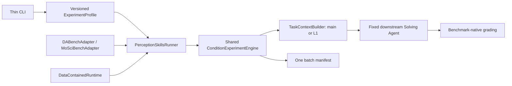

# Perception Skills Downstream Experiment

This experiment measures perception skills through the performance of the
unchanged downstream Solving Agent. Perception skills are used only to produce
frozen L1 annotations; the solver sees an annotation, never a skill file.

## Conditions

`main` is the benchmark's original Dataset Description. It is a useful
reference, but it is not a perception-skill arm. `no-added-skill-v1` and the
skill arms are independently generated L1 annotations.

| Benchmark | Frozen protocol | Conditions |
| --- | --- | --- |
| DABench | `perception-skills-dabench-v1` | `main`, `no-added-skill-v1`, `dataset-semantics-v1` |
| MoSciBench | `perception-skills-moscibench-v1` | `main`, `no-added-skill-v1`, `dataset-semantics-v1`, `scientific-modalities-v1` |

The causal perception-skill contrast is `no-added-skill-v1` versus a skill
arm. A comparison with `main` also changes the artifact type and annotation
production process, so it must not be described as a pure skill effect.

## Versioned protocol

The built-in profiles in
[`perception_skills/profile.py`](perception_skills/profile.py) freeze the
experimental protocol:

| Setting | DABench | MoSciBench |
| --- | ---: | ---: |
| workflow | `react` | `react` |
| model | `openai/DeepSeek-V4-Flash` | `openai/DeepSeek-V4-Flash` |
| task concurrency | 50 | 88 |
| global/per-key LLM concurrency | 20 / 20 | 20 / 20 |
| LLM retry | 10 | 10 |
| model thinking | disabled | disabled |
| sandbox | bubblewrap, network disabled | bubblewrap, network disabled |
| sandbox timeout | 2 hours | 2 hours |
| device admission | CPU default | CPU default |

These are experiment-profile defaults, not global DSLighting defaults. Every
batch manifest records the profile ID, its fully expanded configuration and
SHA-256, the source fingerprint, Git commit, frozen-input attestations, task
selection and child-run fixed-input hashes.

The orchestrator checks the source fingerprint before and after every
repetition. If the worktree changes, it stops before another repetition can
load a different implementation.

## Run

Validation is the default and does not start a downstream agent:

```bash
./perception-skills run dabench --repetitions 5
./perception-skills run moscibench --repetitions 5
```

Paid execution always requires `--execute`:

```bash
./perception-skills run dabench --execute --repetitions 5
./perception-skills run moscibench --execute --repetitions 5
```

Task selection and condition-level resume remain explicit:

```bash
./perception-skills run dabench --repetitions 1 --tasks dabench-55
./perception-skills run dabench --repetitions 1 --tasks-file tasks.txt --limit 10
./perception-skills run dabench --execute --repetitions 1 --resume RUN_ID
```

Model, workflow and task-concurrency overrides are advanced, noncanonical
operations. They are rejected unless `--allow-protocol-override` is present;
accepted runs are recorded as `noncanonical`.

For a detached run, invoke the same public command in tmux. There is no
separate shell or tmux execution path.

## Annotation production and verification

Annotations are produced offline by isolated Codex annotation agents, not by
the downstream runner or an annotation generator class:

1. Freeze public, task-independent evidence.
2. Give fresh annotation agents the same evidence. The control receives no
   added perception skill; skill arms must read their declared skill first.
3. Do not expose task questions, graders, private answers, sample submissions,
   another arm's output, or downstream results.
4. Validate schema, dataset identity, public-file boundary and column coverage.
5. Atomically publish the complete bundle with input, skill and artifact
   hashes.

DABench has 257 tasks grouped into 51 frozen raw-data families. Its two
generated conditions therefore contain 102 canonical family annotations.
These small frozen outputs and their publication manifest are versioned under
`artifacts/dabench_annotations/`; the larger one-time generation evidence is
represented by its pinned hash and is not a runtime dependency. At run time
the adapter verifies the publication; it never republishes or rewrites it. It
materializes task-identity wrappers in the batch directory and verifies that
their solver-visible rendering is unchanged.

MoSciBench has 88 tasks over six shared annotation units. Its modalities arm
is retained because these datasets contain scientific modalities for which
that added knowledge is part of the experimental treatment.

Statistical analysis must report task-weighted outcomes and cluster-aware or
annotation-unit-equal outcomes. Tasks that share one family/annotation are not
independent annotation samples.

## Architecture



`DataContainedRuntime` prepares the dedicated experiment process before any
benchmark work: it clears proxy variables and pins HOME, temporary state, XDG
directories, uv, Python and library caches below the repository's `data/`
directory. The public launcher calls the existing `.venv` Python directly and
runs with `UV_OFFLINE=1` and `PIP_NO_INDEX=1`; it does not create or
synchronize an environment.

`PerceptionSkillsRunner` resolves the frozen profile and benchmark adapter,
then passes all repetitions and conditions to the same engine used by the Data
Card level experiment. Conditions run directly through `DSBenchmark`; no JSON
handoff, child Python runner, or per-condition orchestration layer exists.

## Results

Batch manifests are written under
`data/experiments/data_card_ablation/batches/<batch-id>/manifest.json`.
This is the only experiment manifest. It records the expanded protocol,
runtime and benchmark inputs once, followed by one record per repetition and
condition with annotation hashes, task outcomes, scores, submissions and
context audits. Resume reads the same file, skips verified completed
conditions, and reruns an incomplete condition as one unit.
