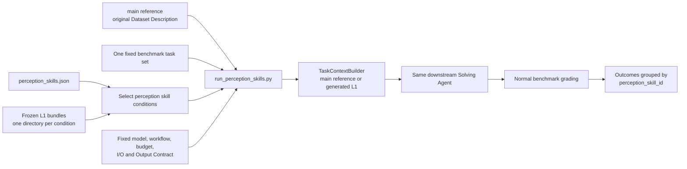

# Perception Skills Downstream Experiment

This experiment asks whether perception skills improve annotations enough to
improve a fixed downstream Solving Agent. It is separate from the Data Card
level experiment in [`README.md`](README.md). It includes one `main` reference
using the benchmark's original Dataset Description and three generated
annotation conditions.

## Experimental variable

The default downstream comparison is:

| Condition ID | Context supplied to the Solving Agent |
| --- | --- |
| `main` | Benchmark-provided Dataset Description; no generated annotation |
| `no-added-skill-v1` | Control: no additional perception skill |
| `dataset-semantics-v1` | `perceive-dataset-semantics` |
| `scientific-modalities-v1` | Dataset semantics plus scientific-modality knowledge |

`main` is a reference condition, not a perception skill. The experimental
treatment among the other three conditions is the reviewed L1 annotation
bundle selected by `perception_skill_id`.

The registry is
[`skills/perception_skills.json`](skills/perception_skills.json). Skill files
identify how each frozen annotation bundle was generated; the downstream
runner does not execute or expose them. The Solving Agent receives only the L1
Semantic Data Map selected for its condition.

Everything else is fixed within one invocation:

- benchmark source, tasks, public data, and grading contract;
- downstream model, workflow, budget, and concurrency;
- Data Perception and Data Profile behavior;
- I/O instructions, output artifact name, and Output Contract;
- the canonical execution path.

`--concurrency` sets the benchmark task ceiling, scheduler LLM ceiling, and
single-key LLM pool ceiling to the same value. The full local launcher uses 88
for all three so the API pool does not silently retain its default limit of 20.
This experiment also fixes `gpu_policy=cpu_default` for every condition. Tasks
that do not explicitly require a GPU therefore use the CPU pool instead of
being admitted one per detected GPU; explicitly GPU-required tasks can still
request a GPU. At concurrency 88, the machine must have enough CPU, memory, and
disk capacity for up to 88 admitted task sandboxes.

The `main` reference uses task-context policy `main`. All generated annotation
conditions use policy `l1`; this policy difference is the declared boundary
between the original Dataset Description and an external L1 map. It is not
treated as a perception-skill difference.

The runner verifies the complete fixed configuration before execution. After
each condition, it audits the main data-report digest, final I/O digest, output
artifact name, submission contract, and evaluation-contract reference against
the first completed condition.

## MoSciBench design

The default source is MoSciBench. With no task selection, all 88 registry tasks
run under `main` and all three generated annotation conditions, producing 352
downstream solver runs. The generated annotations share six annotation units:

- `mosci-cyclone`
- `mosci-health_spa`
- `mosci-massspecgym`
- `mosci-nurse_stress`
- `mosci-pop_genetics`
- `mosci-terra`

Each condition therefore has six L1 files under
`artifacts/annotations/<perception_skill_id>/`. Tasks over the same underlying
dataset reuse the same map. Statistical analysis must treat those six
annotation units as clusters rather than treating all 88 tasks as independent
annotation samples.

## Control flow



## Run

The script loads the repository `.env` without overriding values already in
the process environment. `--model` is optional and otherwise resolves from
`LLM_MODEL` through the normal `ConfigBuilder` path.

Validate all MoSciBench tasks and all four conditions without starting an
agent:

```bash
uv run --no-sync python experiments/data_card_ablation/run_perception_skills.py \
  --data-root data/releases/moscibench_full/moscibench \
  --dry-run
```

Run the full downstream experiment:

```bash
uv run --no-sync python experiments/data_card_ablation/run_perception_skills.py \
  --data-root data/releases/moscibench_full/moscibench \
  --concurrency 88
```

For a detached local run with proxy variables explicitly removed, use
`run_moscibench_perception_skills_tmux.sh` inside a tmux session. The wrapper
also pins all uv cache, Python, and tool directories under the repository's
`data/.uv` tree and writes a timestamped stdout log.

Select conditions or tasks for a smoke run:

```bash
uv run --no-sync python experiments/data_card_ablation/run_perception_skills.py \
  --data-root data/releases/moscibench_full/moscibench \
  --perception-skills no-added-skill-v1,dataset-semantics-v1 \
  --tasks mosci-cyclone-1 \
  --dry-run
```

`--tasks-file` and `--limit` behave like the level runner. A different
MLE-contract benchmark can use the same entry point when it has a reviewed
benchmark profile and a complete `<perception_skill_id>/<dataset_id>.json`
annotation tree supplied via `--annotations-root`. Use `--exclude-main` only
when a pure comparison among generated annotation conditions is desired.

## Results

Non-dry runs write
`runs/perception_skills/<run-id>/manifest.json`. Each run record is keyed by
`condition_id`; generated conditions additionally record
`perception_skill_id`. Records contain per-task workflow, submission, score,
and context-audit outcomes. Skill entrypoints, the skill registry, and every
L1 bundle are pinned by SHA-256 digest. Infrastructure or comparability
failures fail the experiment; solver or invalid-submission outcomes remain
measured downstream outcomes and do not skip later conditions.
